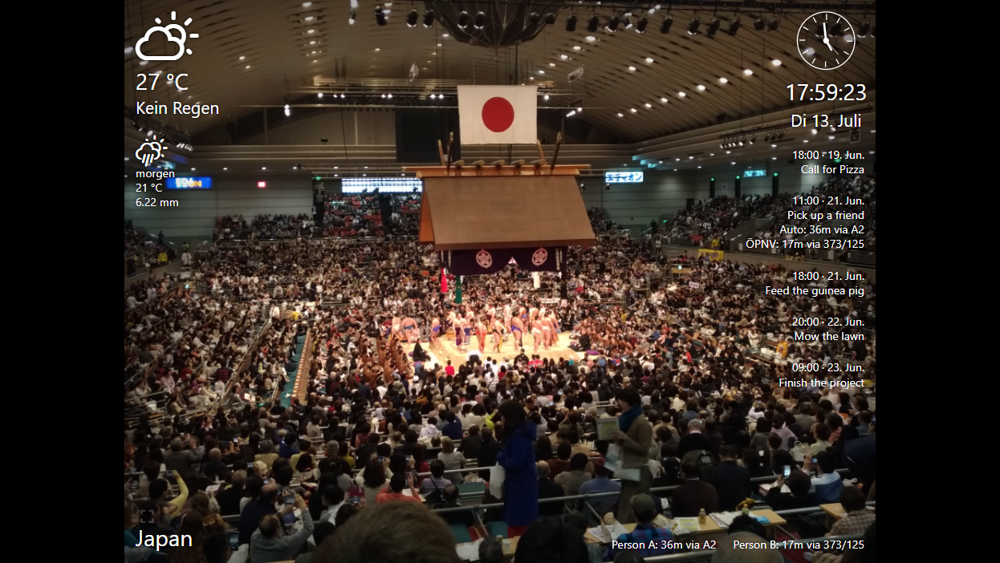

# Woiziframe

This web application displays photos from disk.

Features:

- A new photo is selected randomly every few seconds.

- The screen size is limited to a 4/3 ratio.

- The photo is resized to fit the screen. The remaining screen space is filled with a blurred variant of the image.

- The current weather and tomorrow's weather are shown as icon and temperature

- The current time and date is shown.

- The album title is shown at the bottom of the screen.

- A button toggles the fullscreen browser mode.

This project is based on The Google Photos client [anton-lunev/photo-frame](https://github.com/anton-lunev/photo-frame) and [krzysztofsaja/angular-weather-widget](https://github.com/krzysztofsaja/angular-weather-widget)

This project was generated with [Angular CLI](https://github.com/angular/angular-cli) version 12.0.4.

## Development server

Run `mpn start` for a dev frontend server. Navigate to `http://localhost:4200/`. The app will automatically reload if you change any of the source files.

Run `npm run server` for a backend server. Navigate to `http://localhost:4201/albums` or `http://localhost:4201/files?album=[albumname]` or `http://localhost:4201/file/[albumname]/[filename]`.

## Code scaffolding

Run `ng generate component component-name` to generate a new component. You can also use `ng generate directive|pipe|service|class|guard|interface|enum|module`.

## Build

Run `ng build` to build the project. The build artifacts will be stored in the `dist/` directory.

## Running unit tests

Run `ng test` to execute the unit tests via [Karma](https://karma-runner.github.io).

## Running end-to-end tests

Run `ng e2e` to execute the end-to-end tests via a platform of your choice. To use this command, you need to first add a package that implements end-to-end testing capabilities.

## Further help

To get more help on the Angular CLI use `ng help` or go check out the [Angular CLI Overview and Command Reference](https://angular.io/cli) page.
